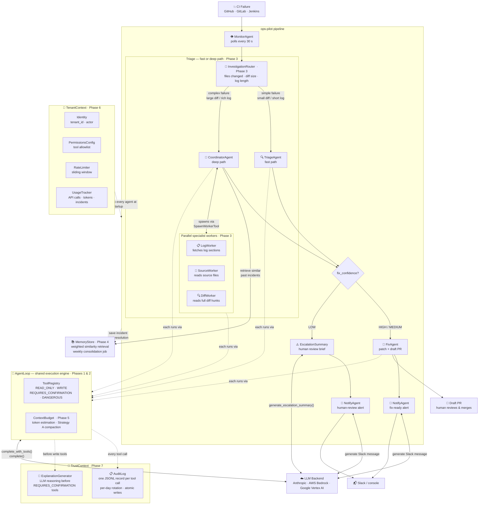

# ⚡ ops-pilot

**AI agents that watch your CI/CD pipelines, diagnose failures, write the fix, and open a pull request — while your engineers sleep.**

> **Who this is for:** platform engineering teams running 10+ services on GitHub Actions / GitLab CI / Jenkins who are tired of the 2 AM CI page.

> Built by **[Adnan Khan](https://adnankhan.me)** · [LinkedIn](https://linkedin.com/in/passionateforinnovation)

[](https://github.com/adnanafik/ops-pilot/actions)
[](https://www.python.org)
[](LICENSE)

---

## 🎮 Live Demo

**[→ Try it now: adnanafik.github.io/ops-pilot](https://adnanafik.github.io/ops-pilot/)**

> Click a scenario, watch four AI agents light up in sequence, and see the generated PR and Slack message appear — no sign-up, no API key, runs entirely in your browser.


---

## What problem does this solve?

When a CI pipeline breaks at 2 AM, an engineer gets paged. They dig through logs, find the root cause, write a fix, open a PR, and notify the team. That cycle takes 30–90 minutes even for experienced engineers — and it's mostly mechanical work.

**ops-pilot automates the mechanical part:**

- 🔍 **Detects** the failure and pulls the relevant logs
- 🧠 **Diagnoses** the root cause using Claude (severity, affected service, confidence)
- 🔧 **Writes a fix**, commits it to a branch, and opens a draft PR for human review
- 📣 **Notifies** your team on Slack with a concise summary

Engineers still review and merge. ops-pilot handles the 2 AM triage.

---

## Quickstart

**Try the demo in 3 commands — no API key needed:**

```bash
git clone https://github.com/adnanafik/ops-pilot && cd ops-pilot
docker compose up ops-pilot-demo
open http://localhost:8000
```

**Run against your real pipelines (no local Python needed):**

```bash
cp .env.example .env        # add ANTHROPIC_API_KEY + GITHUB_TOKEN
# edit ops-pilot.yml — add your repos under pipelines:
docker compose --profile watcher run --rm ops-pilot-watcher \
  python3 scripts/watch_and_fix.py --once --dry-run   # triage only, no PRs opened
docker compose --profile watcher run --rm ops-pilot-watcher \
  python3 scripts/watch_and_fix.py --once              # full run — opens draft PRs
```

**Configure your repos in `ops-pilot.yml`:**

```yaml
anthropic_api_key: ${ANTHROPIC_API_KEY}
github_token: ${GITHUB_TOKEN}
slack_bot_token: ${SLACK_BOT_TOKEN}

pipelines:
  - repo: myorg/backend
    slack_channel: "#platform-alerts"
    severity_threshold: medium    # skip low-severity noise

  - repo: myorg/payments
    provider: gitlab_ci           # GitHub Actions, GitLab CI, or Jenkins
    slack_channel: "#payments-oncall"
    severity_threshold: high
```

---

## How it works



### The 30-second version

| Step | Agent | What it does |
|------|-------|-------------|
| 1 | **Monitor** | Polls GitHub Actions / GitLab CI / Jenkins every 30s. Finds new failed runs, fetches log output. |
| 2 | **Triage** | Runs an agentic tool-use loop: reads source files, fetches earlier log sections, diffs commits — until it has enough signal to conclude. Returns root cause, severity (LOW→CRITICAL), affected service, and fix confidence. |
| 3 | **Fix or Escalate** | If confidence is MEDIUM or HIGH: commits a patch and opens a draft PR. If confidence is LOW: generates an escalation summary (what was investigated, what was inconclusive, recommended next step) — no PR is opened; a human is required. |
| 4 | **Notify** | Posts a one-paragraph Slack summary: fix-ready alert with PR link, or escalation alert requesting human review. Falls back to console in dev mode. |

Every tool call (file reads, commits, PR opens) is written to a structured JSONL audit log. Destructive tools (`update_file`, `open_draft_pr`) get a pre-action LLM explanation generated before execution — observable without blocking.

**Deduplication:** ops-pilot uses open GitHub/GitLab PRs as its source of truth. If a PR for a commit already exists, it waits — it will never spam your repo with duplicate PRs, even after a crash or redeploy.

---

## Architecture

Four agents (Monitor → Triage → Fix → Notify), each extending `BaseAgent[OutputT]` and running on a generic `AgentLoop` that handles tool-use iteration. Agents communicate via Pydantic models — no raw dicts cross boundaries. Tools are permission-tiered: READ_ONLY → WRITE → REQUIRES_CONFIRMATION, enforced by `ToolRegistry`. Memory, context budgeting, trust (audit log + pre-action explanation), and multi-tenancy are isolated modules in `shared/`.

→ **[Full architecture](docs/ARCHITECTURE.md)** · **[Why these design decisions?](docs/DESIGN.md)**

---

## LLM backends

ops-pilot works with any of the three — switch by changing one config line:

| Backend | Config | Auth |
|---------|--------|------|
| **Anthropic API** (default) | `llm_provider: anthropic` | `ANTHROPIC_API_KEY` |
| **AWS Bedrock** | `llm_provider: bedrock` | IAM role / `AWS_ACCESS_KEY_ID` |
| **Google Vertex AI** | `llm_provider: vertex_ai` | ADC / `GOOGLE_APPLICATION_CREDENTIALS` |

```yaml
# Switch to Bedrock — no agent code changes needed
llm_provider: bedrock
aws_region: us-east-1
model: anthropic.claude-sonnet-4-5-20251001-v1:0
```

---

## Claude Code integration

ops-pilot ships with 5 slash commands for [Claude Code](https://claude.ai/code) in `.claude/commands/`. Open this repo in Claude Code and use them directly — each one reads the actual source files before acting, so it follows the project's exact patterns.

```bash
# Diagnose a CI failure from log output or a description
/triage "auth service null pointer on commit a3f21b7"

# Add a new pipeline — detects provider, validates config, runs Python to confirm
/add-pipeline myorg/my-service provider:github_actions

# Scaffold a full CIProvider implementation (factory + __init__ wired automatically)
/new-provider CircleCI

# Run the watcher — checks .env, shows configured pipelines, then starts
/run once --dry-run

# Generate a new demo scenario JSON from a failure description
/scenario "Redis connection timeout in payment service"
```

Every command is defined in `.claude/commands/<name>.md` — edit the `.md` file to change how Claude approaches the task.

---

## How is this different from…

| | ops-pilot | Sweep | Copilot Workspace | Sentry Autofix | Aider |
|---|---|---|---|---|---|
| **Triggered by** | CI failure (autonomous) | Human-filed GitHub issue | Human opens a task | Production exception | Human CLI prompt |
| **Scope** | CI pipeline failures only | Any feature/bug | Any coding task | Runtime errors | Any code change |
| **Produces** | Triage + draft PR + Slack alert | Draft PR | PR | Patch suggestion in Sentry UI | Local diff |
| **Observability** | JSONL audit log + pre-action LLM explanation | — | GitHub-native | Sentry-native | — |

---

## Related

**[retro-pilot](https://github.com/adnanafik/retro-pilot)** — autonomous post-mortem generator.
ops-pilot catches the failure and opens a PR. retro-pilot takes the resolved incident and produces a structured post-mortem stored in a searchable knowledge base.

---

## Running tests

No local Python install required — runs inside Docker:

```bash
docker compose run --rm test                  # 335 tests
docker compose run --rm test pytest -k triage # single agent
docker compose run --rm test ruff check agents/ shared/
```

Or locally if you have Python 3.11+:

```bash
pip install -e ".[dev]"
pytest
```

---

## About the author

Adnan Khan builds AI systems for platform engineering teams. [LinkedIn](https://linkedin.com/in/passionateforinnovation) · [adnankhan.me](https://adnankhan.me)

---

## License

MIT © 2026 Adnan Khan
